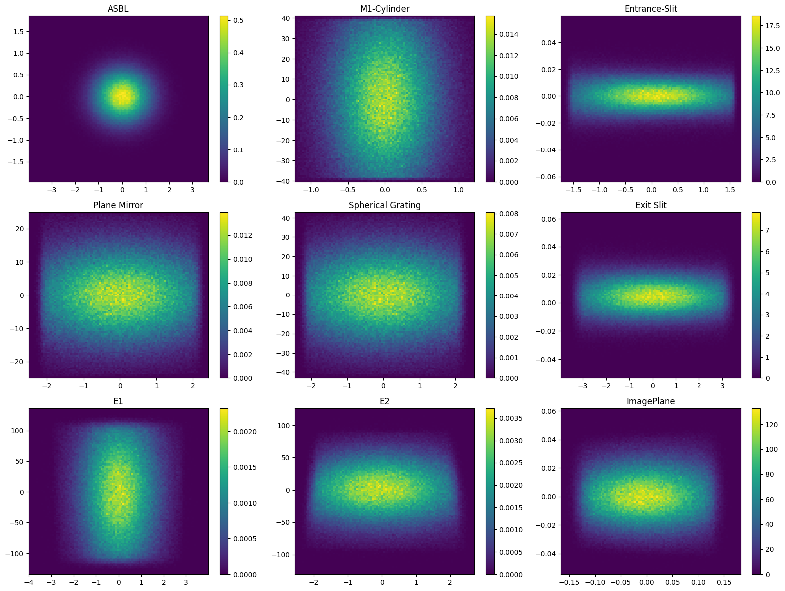
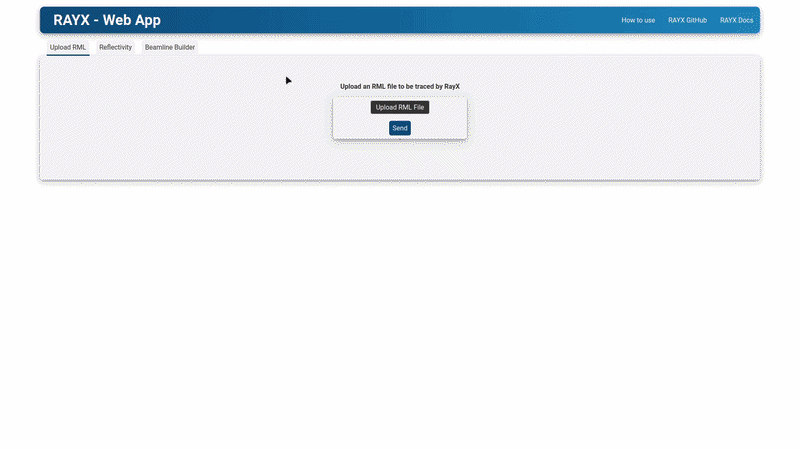
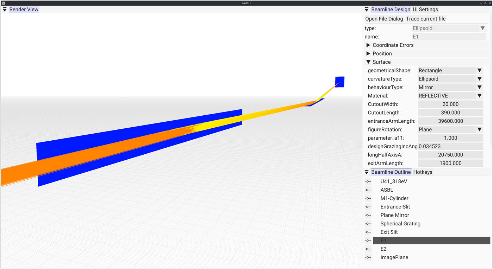

# RAYX
[](https://hz-b.github.io/rayx/latest/)
[](https://hz-b.github.io/rayx/latest/Introduction/03-Getting-Started/)
<table>
  <tr>
    <td>
      
    </td>
    <td>
      <strong>RAYX</strong> is a powerful, multi-component simulation platform designed to streamline the design and optimization of beamlines in synchrotron light source facilities. At the core of the platform is <i>rayx-core</i>, a high-performance library that delivers precise light tracing capabilities on both CPUs and GPUs. This core library ensures that users can achieve detailed and accurate simulations at high speeds, making it an ideal solution for complex beamline designs.
    </td>
  </tr>
</table>

To simplify the usage of _rayx-core_, the platform includes rayx, a command-line interface (CLI) tool designed for fast, one-shot tracing of beamlines. It provides comprehensive data on every ray-element intersection, making it especially valuable for generating large datasets efficiently. With its focus on ease of use, _rayx_ empowers users to quickly run simulations and retrieve detailed ray-tracing results.

## RAYX vs RAY-UI

RAYX offers several advanced features, including: 
- Global (not sequential) tracing of beamlines 
- GPU utilization for accelerated tracing performance 
- A dedicated mode for tracing multiple beamlines with ease 
- Objects in RAYX can be grouped for simplified group transformations 
- A GUI for intuitive beamline design

## Installing or Building RAYX

[](https://github.com/hz-b/rayx/actions/workflows/testUbuntu.yml) [](https://github.com/hz-b/rayx/actions/workflows/testWindows.yml) [](https://github.com/hz-b/rayx/actions/workflows/testUbuntuClang.yml) [](https://github.com/hz-b/rayx/actions/workflows/mkdocsDeploy.yml)


For additional information, please visit our [Wiki](https://hz-b.github.io/rayx/) and read our latest [paper](https://pubs.aip.org/aip/rsi/article/96/6/061302/3348292/RAYX-An-optics-simulation-software-for-synchrotron), that introduces RAYX to the scientific community. We are committed to delivering stable releases, which can be found [here](https://github.com/hz-b/rayx/releases). Please note that the `master` branch and other branches might be unstable, and building RAYX from the source could lead to unstable software. We recommend this only for developers and experienced users. If you experience issues with our distributed binaries or API, do not hesitate to [open an issue](https://github.com/hz-b/rayx/issues/new/choose) or contact us directly at [rayx-support@helmholtz-berlin.de](mailto:rayx-support@helmholtz-berlin.de). We are keen to provide assistance and develop features as the need arises.

## Built with RAYX

### RAYX Python Bindings
[](https://github.com/hz-b/rayx-python)



To simplify the integration of RAYX into Python-based workflows, we provide Python bindings that allow direct simulation results. The figure above illustrates the simulated output at each element of a beamline using the *RAYX Python Bindings* and *Matplotlib*.

To add RAYX to your Python project simply install the package by typing: ```pip install rayx```

### RAYX-WebApp

[](https://github.com/win-vid/rayx-webapp)



A lightweight Flask-based web application for visualizing <a href="https://github.com/hz-b/rayx">RAYX beamline simulations</a> .
The web app allows users to upload an `.rml` file, trace the beamline using the *RAYX Python bindings*, and interactively inspect the resulting ray distributions as 2D histograms with per-element breakdowns. 

### RAYX-UI



For users who prefer a more visual approach, _rayx-ui_ offers a graphical user interface (GUI) that includes a 3D viewport of the beamline, enabling interactive design and exploration. This GUI provides an intuitive interface to construct and modify beamlines, allowing users to visualize their designs in real-time. _rayx-ui_ not only enhances the design process but also allows users to iteratively optimize configurations based on immediate visual feedback.

## Relevant Publications

If you use **RAYX** in your scientific work, please consider citing our paper:

**RAYX – An optics simulation software for synchrotron applications**
Sven Erdem, Peter Feuer-Forson, Jannis Maier, Felix Möller, Enrico Philip Ahlers, Valentin Stöcker, Fanny Zotter, Peter Baumgärtel, Jens Viefhaus
[Review of Scientific Instruments, Vol. 96, Issue 6 (2025)](https://pubs.aip.org/aip/rsi/article/96/6/061302/3348292/RAYX-An-optics-simulation-software-for-synchrotron)
DOI: [10.1063/5.0253857](https://doi.org/10.1063/5.0253857)

> We present RAYX, an advanced optics simulation software for synchrotron applications and the successor to RAY/RAY-UI \[Schäfers, in *Modern Developments in X-Ray and Neutron Optics*, Springer, 2008]. RAYX offers a modern, versatile platform designed to accelerate beamline design, optimization, and data analysis, including machine learning workflows. It supports accurate and efficient simulations across a wide spectral range and optical elements, tailored for current and next-generation synchrotron facilities.

This publication provides an overview of the software's architecture and capabilities, including GPU acceleration, Python bindings, and GUI support.

### Further Publications

* <a href="https://doi.org/10.1107/S1600577524003850">Automated spectrometer alignment via machine learning</a>

* <a href="http://doi.org/10.1088/1742-6596/3010/1/012131">Inverse Surrogate Model of a Soft X-Ray Spectrometer using Domain Adaptation</a>