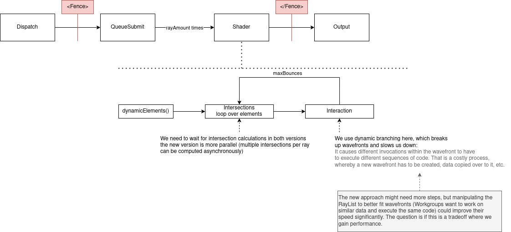
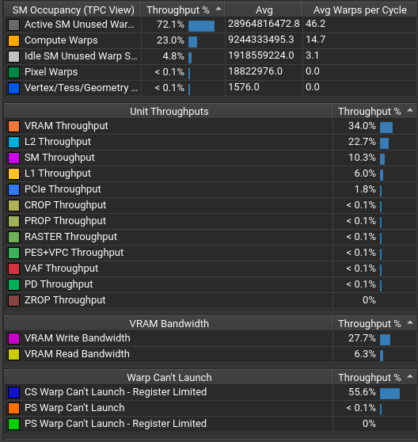
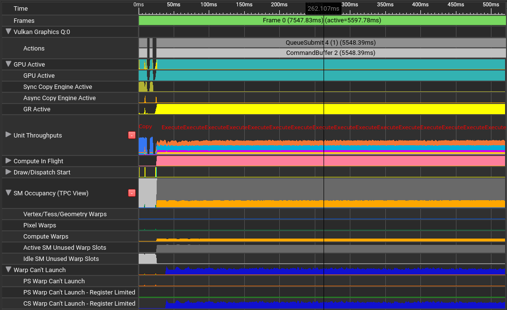
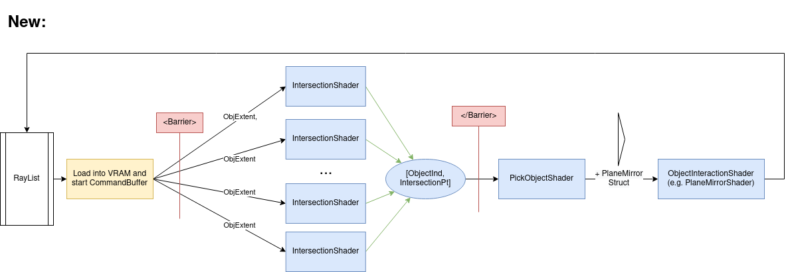
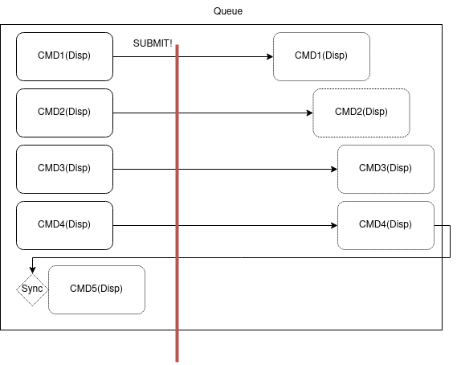

# Vulkan one stage Compute Pipeline and beyond... A Vulkan Case Study

### Note 
_Please note that this page has been written from a Vulkan beginner's perspective. All information and facts are bound to change and tend to be misleading at times._

# Introduction
We have followed an extensive research on RAYX Execution Model on the GPU side and found plenty of rabbit holes and possible bottlenecks that might lead to future misbehaviours or loss in performance. In this blog-like post, we explain some of the mentioned issues and possible solutions to overcome them. When needed, this post can be a starting point to a code refraction in RAYX.

## What is Vulkan?
The GPU is a massive die on Chip that has plenty of processing cores (Similar to a CPU Core but only with very basic Arithmetic Operations FP/INT32). The GPU excels in SIMD (Single Instrct. Multiple Data) operations. It is basically a huge parallel machine that tries to execute the same operation (Pixel coloring, coordinate calculation etc.) on a wide range of data. For this purpose, GPUs are used in a more abstract field other than simply "graphics"; General Purpose Compute on GPU (GPGPU), which is mainly what RAYX on Vulkan relies on. Vulkan? WHO?

Nvidia and AMD are the main GPU manufacturers. As both GPU architectures slightly differ and Nvidia ... isn't a fan of open-source... we decided to use an All-in-One compatible tool to talk to the GPU. *Enter Vulkan*. A "new" API used to control the GPU for all (Not really, we'll talk about this later) purposes developed to compete against OpenGL and alike. But most of all, open-source! Vulkan is increasingly gaining popularity and is the new state of the art for developing GPU Solutions. However it is the most NOT beginner-friendly API that you can learn. Vulkan is created to give the user the uttermost control over hardware at the price of complexity and low-level execution. It can be very fast and performant but to reach that level you need to cover all aspects and gotchas that vulkan(the dev) might fall into.

## GPU + CPU = <3
We can talk about Vulkan and how it works for weeks and still have more topics that we haven't covered. By the way, a very effecient way to learn about it, is to simply read the Vulkan-Samples made by Khronos and others.  But let's suppose that we have already created a working Vulkan Environment and we are ready to talk with the GPU... "GPU, do this!".

To do as such, we need to record a **Command** in a **Command Buffer**. The Vulkan **Pipeline** will know which installement we need and which **Shader Module** we intend to run the GPU. The Command is then stored in a **Queue**. The Queue can be seen as a stack memory that accepts commands sequenctually... A then B then C... The Queue is **submitted** to the GPU. Finally we simply **wait until idle** i.e wait until our gpu compute code is terminated as we don't need any render workload or such from the GPU. So that we can proceed with further code.

All of this is executed on the CPU-side. The GPU takes the heavy-lifting and the actual execution of Compute only once queue is submitted. This is a good example of async computation which means that two things are doing seperate operations and they **Synchronize** with each other at different times. The CPU proceeds with data analysis or plotting only when the GPU is idle.

Through Vulkan, the GPU offers about 16 Queue Families (Check your vkinfo) to stack commands inside for execution. Hence the described procedure does not happen once in a standard GPU pipeline and does not have to be unique. 

## Nvidia GA102 Dive 
[You can find GA102 Architecture whitepaper at Nvidia's](https://www.nvidia.com/content/PDF/nvidia-ampere-ga-102-gpu-architecture-whitepaper-v2.pdf)

Before discussing the issues at hand, now is a good chance to dip our hands a bit in the Hardware Side of Nvidia's latest GPU high-end architecture. Although, the dies become faster, and more power demanding, the idea behind a gpu still remains the same throughout the last generations. 

A full GPU is mainly made out of memory and execution cores. 
The execution cores can be seen as a hierachical abstraction. The GPU (GA102 as reference) has 7 GPCs. Each GPC consists of 12 TPCs. Each TPC is made out of 2 SMs. Each SM has a **Warp Scheduler, a 64KB register File (Registers), Load/Store Units and 32 CUDA FP32/INT32 cores.**

This GPU has 84 SMs overall and that is the most important unit in understanding the GPU Design. An SM (Streaming Multiprocessor) is a scalable core and a Cuda Core is the arithmetic brain for operations inside the SM.

Memory consists of a big VRAM (DRAM) outside of the SoC, L2 Cache and a smaller faster L1 Cache closer to every SM. The register file inside the SM is the fastest and it's used to store any temporary values or branch jump "pointers". 

L1 Cache can also be split into some shared memory that threads can concurrently share at the same time, depending on the configuration.

In the Compute Model, we talk about Warps, hence the warp scheduler. Warps are a "virtual" budnel of threads (Also called Wavefronts at AMD) made out of a pack of 32 Threads that are executed together. The Warp Scheduler takes care of issueing and disaptching the warps from the Intstruction bank to the SMs and cuda cores. It's only up to the Dev to correctly set the size of the Workload and its scalability. The Warp Scheduler will handle the rest. 

## Warps & Divergence
SMs execute instructions in warps, each warp consists of 32 Threads. It is important to notice that all warps in one SM execute the same instruction. Once done the scheduler issues the next instruction or decides to schedule another warp if the current has to stall for e.g. (Priority scheduling). The GA102 can schedule 4 warps at one cycle as seen in the figure. The Warp Scheduler is still a black box and very few documents describe it's exact functional model. It's also a piece that changes from one architecture to another and handles data and execution differently. Furthermore, the Warps do not directly map to the local group size and global work size in Vulkan.

A warp is considered active from the point its threads start executing until all threads have finished. SMs have a limit on the number of active warps, meaning the remaining inactive warps will need to wait until the current active ones are finished execuring. The ratio of active warps on an SM to the maximum number of active warps on the SM is called occupancy.

If the code to be executed has if clauses then some threads inside the warp have to execute with masks (Not do anything as the if condition is false ) and the else branch would need to also execute AFTER the warp is done with the first part. This is called Warp Divergence. Even if modern GPUs are becoming better with handling the divergence. Compilers tend to also optimize the shader. It's still viewed as one of the DONT in parallel compute. 

# The current Vulkan Execution Pipeline
## vkDispatch()
The current RAYX Tracer uses 1 Vulkan Pipeline consisting of 1 Shader Module. The Shader module is dispatched once with the amount of needed threads (Rays) through 1 Compute Queue and the GPU would handle the rest. 

The fence shows that we are waiting for the GPU to become idle.

## Shader ifs
The current shader code has many if elif elif branchs which would cause internally a huge amount of divergence. According to [nvidia's devoloper guide](https://docs.nvidia.com/cuda/ampere-tuning-guide/index.html) for tuning:

>The high-priority recommendations from those guides are as follows:
>
>- Find ways to parallelize sequential code.
>- Minimize data transfers between the host and the device.
>- Adjust kernel launch configuration to maximize device utilization.
>- Ensure global memory accesses are coalesced.
>- Minimize redundant accesses to global memory whenever possible.
>- **Avoid long sequences of diverged execution by threads within the same warp.**

The divergence and the need to schedule each divergence is a waste of SMs. Our main function is an if clause by itself, inside of it are more ifs. This is one of the major flows of writing GLSL that we seem to be trapped in for now. Even with compiler optimization and the fact that modern GPUs can easily handle warp divergence, it's still one of the main issues that need to be fixed. New architectures include better divergence methods but we shouldn't rely only on that for better performance.

One thing to consider is that usually most ray bundles react the same way in very small finite surfaces. The divergence only happens at the extremeties of said surfaces/objects or wasteboxes. 

### Creating Shader Modules
To create a pipeline for anything-vulkan, we need to first upload the shader code to the GPU. The shader code is created inside a shader module with the main function as it's entry point. The GLSL code files in RAYX are all packed together and uploaded once. This bundle is too big for standard shader codes and it causes setup speed-loss as vulkan usually hangs in this step waiting for all instructions to be streamed to the GPU. 

## Nsight Graphics Metrics
Nvidia Nsight Graphics is a developer profiling tool that can run GPU Traces (And many other Profiling traces). It supports Vulkan natively which makes it the perfect candidate. The only problem is that RAYX still does not have a Vulkan Window as we only do compute. So Nsight Graphics is very limited and cannot catch "frames" for tracing. The GPU Trace produces a resource usage timeline and can also name the possible bottlenecks and reasons for low throughput if any. So what does Nsight Graphics say about RAYX Application?

### Metrics 
Well, not good stuff.. 
Below are the Metrics, recorded from a run of 1.5 million Rays:

Notice:
- High "CS Warp Can't Launch -  Register Limited"
- Low SM Throughput
- High "Active SM Unused Warp slots on ative SM"

The timeline shows more detailed information about the execution:

Notice the bottlneck in the Compute Warps, stopping at almost 25% and the constant CS Warp Can't launch.

Aren't we supposed to get a higher SM Throughput?.. Shouldn't the compute warps reach 95% ?..

## Problem Explained
The divergence and the massive amount of shader code to execute in one thread / Warp causes a register pressure. Furthermore we have plenty of loops inside the shader code that might have been unrolled which is causing stalled Warps and the SM being not able to issue to all available CUDA Cores at once. Per Cycle, we are only using 22% of Available Warps. The SM is only using very specific alu fonctions and not even close to hitting 10% mark of the different operations that it can do (FMA Pipe for Floating precision being 5%). This can be better improved by reducing the stalled Warps. 

Nsight also recommends that we solve the issue  as the SM is "running out of register-file space" by moving to async compute.

It's however worth mentioning that this is one of the most common SM-occupancy limiters for pixel and compute shaders. [[blog]](https://gengwg.blogspot.com/2020/03/the-peak-performance-percentage.html)

# Suggested Vulkan pipeline

## Async Compute
To solve this we use the queue in vulkan and send as many small known commands as possible with smaller shader codes instead of one big block of GLSL. We use multiple Compute Queues if needed and let the Warp Scheduler control the rest. We obviously need  a few synchronization points as we are now out of the global scope i.e we need to wait until rays intersect before reflecting, to send more specific commands. This is getting closer an async ompute model! For each stage/compute step we dedicate a vkPipeline preloaded with the shader and all what's left is to correctly bind the Descriptor Sets and push the command at the right time into the Queue.

The new Compute Pipeline Pass:

A look into a standard usage of queues:

One issue remains to be solved (or mainly discussed) is as now we are sending commands per Object and per run. We need to know what type of object the ray intersects to feed it the correct shader module. For that we propose these solutions:

The solutions are straight-forward. Solution 2 and 5 are the top-picks as they rely on on async compute the most.

This is still a bound-to-fail idea as we are not sure if it will solve the register and idle Warps problem. But it will surely change some the vulkan code structure.

### Pros:
- Better readability
- Easier debugging as now if the compute unit fails there is no way of finding where and what happened inside the GPU.
- Better SM occupancy and throughput as the code to be executed becomes more similar, smaller and easier to run in parallel on multiple Wraps at a time WITHOUT need for divergence scheduling.

### Cons:
- More complicated
- Memory Synchronization is needed to avoid read before write and overwrite. This can hinder performance if done wrong.
- More Shaders, and the sum of all shaders combined will be bigger than one shader for all. (Duplicate help functions etc..)

The main goal is that the pros and the wasted Unused Warps would overcome the cons mentioned.

# OpenCL vs Vulkan 

A big downset of the new implementation is that it's still being made inside Vulkan. For that we can replace all of Vulkan's API with a pure GPGPU API: OpenCL.

As mentioned earlier Vulkan is not meant to be purely for compute as CUDA or OpenCL etc. but to include compute stages betweenn other render passes. Which makes the pure compute dev work even harder and more time consuming. 

OpenCL is lightweight and easier to understand and recreate than Vulkan. It's definitely not faster than OpenCL. It's also older. But still valid for such cases and most of all supported by nvidia and amd. 

