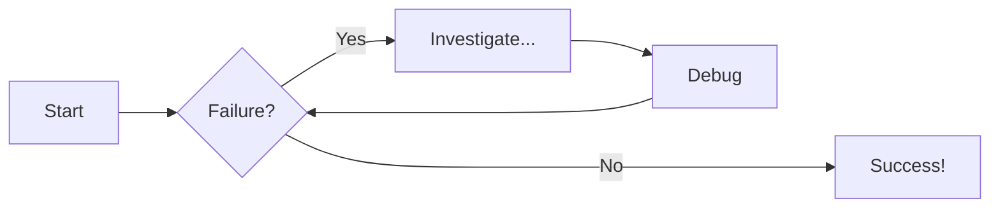

# Writing Documentation for RAYX

This site is build from Markdown files inside the `docs` directory, based on the configuration in `mkdocs.yml`.
The page structure is defined in `docs/.nav.yml`, see [mkdocs-awesome-nav](https://lukasgeiter.github.io/mkdocs-awesome-nav/features/nav/).

The API documentation is built using [Doxygen](https://doxygen.nl/) together with [MkDoxy](https://mkdoxy.kubaandrysek.cz/).

Versioning of the site is implemented using [Mike](https://github.com/jimporter/mike). The CI takes care of the necessary steps, but it is also possible to manually add, update or remove versions as needed.

## Local Development Setup

To build and test the documentation locally, install the python `docs` dependencies from `pyproject.toml` as well as `doxygen` (for the API documentation).

With [uv](https://docs.astral.sh/uv/) setting up a virtual environment and installing locked dependencies is done with:

```sh
uv sync --locked --group docs
```

Then either activate the virtual environment or prefix commands with `uv run`.

Start the live-reloading docs server locally with:

```sh
mkdocs serve --livereload
```

## Temporarily disabling MkDoxy

When working on documentation the local server takes some time to check and link the API documentation, even though the `Doxygen` output is cached to a `.mkdoxy` dir and only regenerated when necessary.
`MkDoxy` can be temporarily disabled with the environment variable `ENABLE_MKDOXY`

```sh
ENABLE_MKDOXY=false mkdocs serve
```

This is useful when writing documentation pages that don't use the API docs and you want to check the resulting page regularly, e.g. when using a lot of math.

## Markup

Here is a quick overview of some of the available Markdown syntax.
You can have a look at the source of this file too.
This is also possible directly in the browser for every page on this site. 
At the top there is a link to view the source.

For a more thorough documentation have a look at the [Material for MkDocs reference](https://squidfunk.github.io/mkdocs-material/reference/).

### Linking to other pages

Using markdown links **relative** to the current file (not the current page) this syntax is simply:

```md
[Home](index.md)
```

[Home](index.md)

### Images

There are some additional settings available for images that are not part of core markdown, like sizing and captions, see [Image Options](https://squidfunk.github.io/mkdocs-material/reference/images/).

{ width="300" }
/// caption
RAYX Logo with a width of 300px
///

### Lists

- Unordered
- List
    - Nested levels need 4 spaces
    
---

1. Ordered
2. List
    1. Next Level
    2. Hi mom

---

- [ ] Unchecked
- [x] Checked
    - [ ] Nested
    - [x] Works
    - [x] aswell

### Math

$$
\cos x=\sum_{k=0}^{\infty}\frac{(-1)^k}{(2k)!}x^{2k}
$$

### Emojis

:slight_smile: :rainbow_flag:

### Source code

- [x] Syntax Highlighting
- [x] Title
- [x] Annotations
- [x] Line numbers
- [x] Highlight lines


```cpp title="Bragg angle computation from Crystal.h" linenums="1" hl_lines="8-9"
/// @brief Computes the bragg angle
/// @param energy photonenergy of the ray
/// @param d lattice spacing*2
/// @param order Diffraction order
/// @return the bragg angle theta (rad)
RAYX_FN_ACC double getBraggAngle(double energy, double dSpacing2) {
    int order = 1;
    double wavelength = hvlam(energy);
    double theta_factor = (order * wavelength) / dSpacing2; // (1)!

    // Check for physical validity
    if (theta_factor > 1.0) {
        return -1.0;  // No reflection possible
    }

    double theta = asin(theta_factor);  // In radians
    return theta;
}
```

1.  :rainbow_flag: SCIENCE! With _inline_ `SCIENCE`  
    Some `Bragg` related math: $n \lambda = 2 d \sin \theta$
    
    Or as a separate block:
    $$
    n \lambda = 2 d \sin \theta
    $$
   

### Admonitions

!!! info "Admonitions"
    Admonitions are great!
    
??? example "Collapsible example"
    Collapsible Admonitions are nice too.
    ```cpp title="Bragg angle computation from Crystal.h"
    /// @brief Computes the bragg angle
    /// @param energy photonenergy of the ray
    /// @param d lattice spacing*2
    /// @param order Diffraction order
    /// @return the bragg angle theta (rad)
    RAYX_FN_ACC double getBraggAngle(double energy, double dSpacing2) {
        int order = 1;
        double wavelength = hvlam(energy);
        double theta_factor = (order * wavelength) / dSpacing2; // (1)!
    
        // Check for physical validity
        if (theta_factor > 1.0) {
            return -1.0;  // No reflection possible
        }
    
        double theta = asin(theta_factor);  // In radians
        return theta;
    }
    ```
    
    1. :rainbow_flag: SCIENCE! With _inline_ `code`

### Diagrams





### Inline API documentation with MkDoxy

This plugin uses `Doxygen` to generate markdown files from the code comments.
You can include parts of the API documentation as Snippets into the written guides using a [tag syntax](https://mkdoxy.kubaandrysek.cz/snippets/).

=== "Tag Syntax"
    ```yaml
    ::: doxy.rayxCore.class.method
    name: rayx::BeamlineNode
    method: glm::mat4 getOrientation()
    ``` 
=== "Resulting Snippet"
::: doxy.rayxCore.Class.Method
name: rayx::BeamlineNode
method: glm::dmat4 getOrientation()
indent_level: 4 

If there is an error inside the MkDoxy Tag it generates a helpful block with the error, available tags and the corresponding snippet.
For example using the tag without any config shows the available projects.

