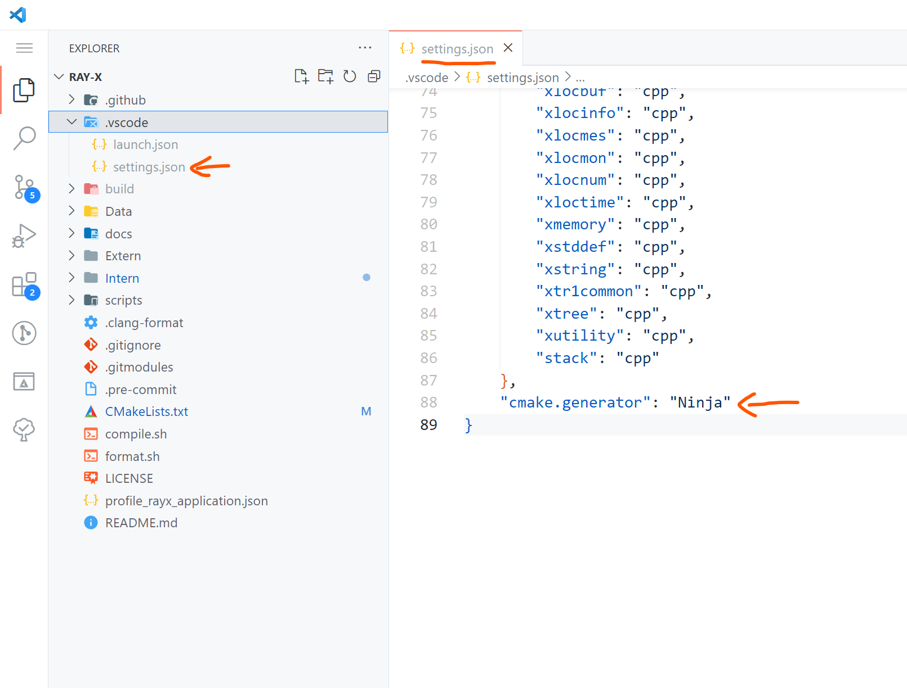

# How to Build

For building and running the project, we recommend using [Visual Studio Code](https://code.visualstudio.com/) (VSCode) as your IDE, along with the C/C++ and CMake Tools extensions. These extensions significantly simplify the building process. However, you are free to use any IDE of your choice. If you are on a UNIX-like system, the `compile.sh` script can be used for compilation (see [using compile.sh](#using-compile.sh)).

## CMake Options:

| CMake Option                | Default value | Description                                                                                 |
| -                           | -             | -                                                                                           |
| `RAYX_ENABLE_OPENMP:BOOL`   | `ON`          | enable search for OpenMP on your system. If found, build with OpenMP for tracing on CPU     |
| `RAYX_REQUIRES_OPENMP:BOOL` | `OFF`         | require OpenMP to be found on your system. Otherwise throw an error                         |
| `RAYX_ENABLE_CUDA:BOOL`     | `ON`          | enable search for Cuda on your system. If found, build with Cuda for tracing on GPU         |
| `RAYX_REQUIRES_CUDA:BOOL`   | `OFF`         | require Cuda to be found on your system. Otherwise throw an error                           |
| `RAYX_ENABLE_H5:BOOL`       | `ON`          | enable search for HDF5 on your system. If found, build with HDF5 for H5 file format support |
| `RAYX_REQUIRES_H5:BOOL`     | `OFF`         | require HDF5 to be found on your system. Otherwise throw an error                           |
| `RAYX_STATIC_LIB:BOOL`      | `OFF`         | This option builds 'rayx-core' as a static library                                          |

## Cloning the Repository

Clone the git repository by running one of the following commands:

- Using SSH:

`git clone --recurse-submodules git@github.com:hz-b/rayx.git`

- Using HTTPS:

`git clone --recurse-submodules https://github.com/hz-b/rayx.git`

## On Windows

### Prerequisites
- Install [CMake](https://cmake.org/download/).
- Install the [Vulkan SDK](https://vulkan.lunarg.com/sdk/home#windows) for Windows (at least version 1.3 or newer).
- Install the [HDF5](https://www.hdfgroup.org/downloads/hdf5/) library.
- Install Python3, python3-dev, and python3-matplotlib.
- We recommend using the MSVC compiler for Windows, available through [Visual Studio](https://visualstudio.microsoft.com/downloads/) (2019 or newer).
- Optional (required for Tracing on the GPU):
    - Install [Cuda](https://developer.nvidia.com/Cuda-downloads?target_os=Windows).
    Tested with Cuda version 12.5.1
    - Add Cuda to your PATH.

### Known Issues
- Installing the VulkanSDK at the root directory of your drive may cause issues. If you encounter problems with the VulkanSDK, consider installing it in a different directory.

### Building with VSCode
- Open the project in VSCode. You will be prompted to select a build kit (e.g., gcc).
- Allow the CMake Extension to configure the project.
- You can then build the project using the build button in the bottom panel.

To use a custom generator for CMake, such as Ninja for faster builds, you can set it in the `.vscode/settings.json` file. The following is an example configuration for the generator in VSCode:

### Building with Visual Studio
- Open a terminal in the project folder.
- Run the following command, replacing it with your version of Visual Studio:

`cmake -S . -B build -G "Visual Studio 16 2019" -A x64 -DCMAKE_BUILD_TYPE=Release`

see: [Cmake Options](#cmake-options)

## On Linux

### Prerequisites
- Ensure cmake, gcc, gdb, and make are installed and up to date.
- Install the Vulkan SDK from [here](https://vulkan.lunarg.com/sdk/home). Select a version under Linux -> Ubuntu Packages.
- Install Python3, python3-dev, and python3-matplotlib.
- The project leverages [libhdf5](https://github.com/BlueBrain/HighFive) for data management and incorporates various other libraries for graphical user interfaces, linear algebra computations, and handling different aspects of the X11 window system. Install the necessary libraries with the following command:
- Optional (required for Tracing on the GPU):
    - Install Cuda
    - see [Determining Cuda and compiler version](#determining-cuda-and-compiler-version)

### Ubuntu
`apt update && apt -y install libblas-dev liblapack-dev libhdf5-dev libgtk-3-dev pkg-config libxi-dev libxcursor-dev libxinerama-dev libxrandr-dev`
- Ensure the libraries are installed at `/usr/include/hdf5/serial` and `/usr/lib/x86_64-linux-gnu/hdf5/serial`.

### Arch Linux
Arch Linux users can obtain all necessary packages through pacman, yay, or other package managers. Specific instructions will be provided later.

### Fedora
To install the required packages on Fedora, run the following command:

`sudo dnf install cmake gcc gdb vulkan vulkan-tools vulkan-validation-layers hdf5-devel ninja-build gcc-c++ vulkan-loader-devel glslc blas-devel lapack-devel gtk3-devel pkg-config libXi-devel libXcursor-devel libXinerama-devel libXrandr-devel boost`

### Determining Cuda and compiler version
- GCC: Depending on the Cuda version, different versions of GCC may be supported.
This projects is tested with Cuda version 12.4.1 and GCC version 13.3
Please take a look at the supported versions of GCC for your Cuda installation:
    - <https://stackoverflow.com/questions/6622454/Cuda-incompatible-with-my-gcc-version>
    - <https://gist.github.com/ax3l/9489132>
- Clang: Using clang as Cuda compiler is currently not supported.

### Using compile.sh
usage: `./compile.sh`
#### Options:
- `--release` build in release mode (default: build in debug mode)
- `--cuda` enable compilation with Cuda (default: build without Cuda)\
see [Determining Cuda and compiler version](#determining-cuda-and-compiler-version) \
example usage: `CXX=g++-13 ./compile.sh --cuda`
