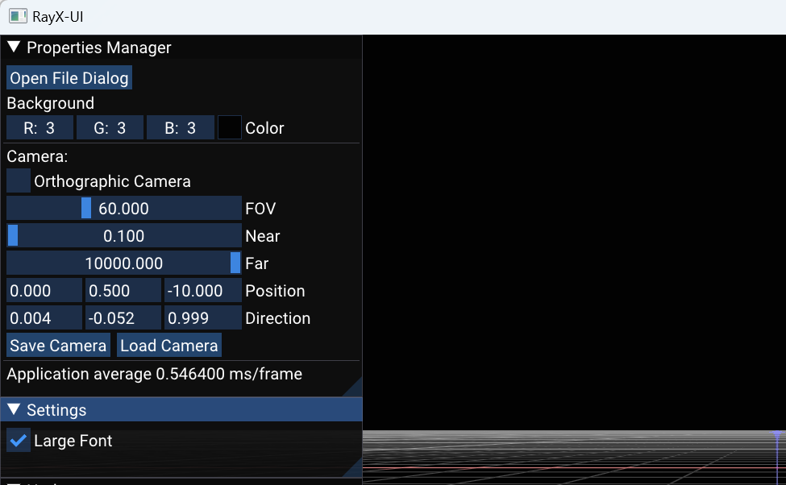

# RAYX-UI User Guide

## Interface

Th window in the image above is accessible in the RAYX-UI application once it's opened. The window provides additional options for adjusting the scene you're viewing. Most notably, the "Open File Dialog" button (indicated by a red arrow) opens a file dialog that allows you to load your .rml beamline file. Currently, the application expects the h5 file (RAYX output) to be located next to it. In the future, tracing functionality will be directly integrated into the interface.

The subsequent camera settings in the interface are intended for advanced users and will not be explained here. If you're unfamiliar with these settings, you likely won't need them. Further down, however, you'll find the "Save Camera" and "Load Camera" buttons, which enable you to save and load a single camera position. This feature can be useful if you wish to save your camera settings for future use or compare different beamlines from the same vantage point.

## Basic Navigation and Control
RAYX-UI is an interface designed for real-time visualization of beamline simulations conducted by RAYX-CORE. The application employs keyboard and mouse inputs for navigation and control.

- **Camera Movement**: Use the `W`, `A`, `S`, `D`, `Q`, and `E` keys to move the camera through the 3D space.
- **Adjust Speed**: Hold down the `Shift` key to adjust movement speed.
- **Camera Direction**: Right-clicking the mouse activates a mode to control camera direction.
- **Toggle Modes**: The application can be toggled between fullscreen and windowed modes using `F11` and `F10` keys, respectively.

## Color Indicators
In the visual representation, various colors are used to indicate specific conditions or states:

- **Just Hit**: Rays that have just hit an element are represented in a yellow to orange gradient.
- **Absorbed**: Rays that are absorbed by an element are depicted in red.
- **Fly Off**: Rays that fly off into space are shown in grey.

**Optical Elements**: Optical elements like slits or image planes are displayed in varying shades of blue, with the color gradient used to represent surface orientation.
