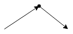
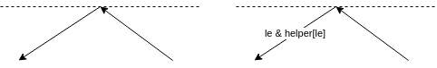
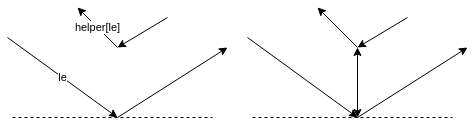
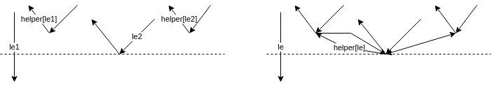
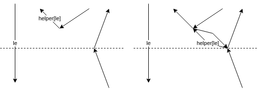
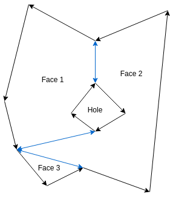
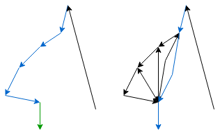
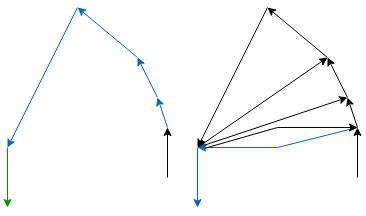

# 2D Triangulation

The triangulation algorithm is based on the algorithm presented in [Computational Geometry](https://archive.org/details/computationalgeo00berg)

## Initial polygon representation

The polygons are represented as a collection of paths for faces and holes.
Faces are ordered in counter-clockwise order and holes in clockwise order.

## Edge list

The edge list a data structure containing all edges of the polygons.
The edges are directed.
A polygon is represented in counter-clockwise order.

Every edge contains:
- A reference to the incoming edge
- A reference to the outgoing edge
- The point of origin

The data structure has a split method.
This method inserts two new edges and updates some incoming and outgoing references.

References before splitting:
- v_prev -> v
- u_prev -> u

References after splitting:
- v_prev -> vu -> u
- u_prev -> uv -> v

Split returns uv and vu.

Example:

## Generate monotone pieces

A polygon is monotone if every line in y direction intersects 0 or 2 edges.

The algorithm is a sweep line algorithm.
The line sweeps from +y to -y.
The algorithm requires a binary search tree, a hash map and a priority queue.
The BST contains every edge that is currently intersecting the sweep line sorted by x position of the intersection.
The hash map maps downward facing edges intersecting the sweep line to edges used for splitting.

1. Add faces and holes to the edge list.
1. Classify edge origins as Regular, Start, End, Split or Merge vertices.
1. Add the edges to a priority queue. Priotity relation: `y1 > y2 || (y1 == y2 && x1 < x2)`
1. Initialize the BST and HM as empty.
1. Process entries of the priority queue in order.

### Classification

Start:

Polygon begin

End:

Polygon end

Regular:

Standard edge

Merge:

Merge two monotone polygons in one

Split:

Split polygon in two monotone pieces

### Processing of a Vertex/Edge

`le*` denotes an edge in the BST and `helper[le*]` the corresponding edge in the HM.
The left part of each diagram is the state before processing and the right part the state after processing.
The dotted line is the current sweep line.
The BST and HM can contain more entries than shown. These entries wont be modified.

#### Start

#### End

Origin of helper is a merge vertex:

Otherwise no new edges will be added.

#### Split

This works for every vertex type of the helpers origin, in this example the helpers origin is a merge vertex:

#### Merge

New edges are only added if a helpers origin is a merge vertex.
In case le1s helper is not a merge vertex, the helper of le is set to the outgoing edge of the currently processed vertex.

#### Regular

##### Left

Origin of helper is merge vertex.

Otherwise no new edge will be added.

##### Right

Origin of helper is merge vertex.

Otherwise no new edge will be added. And the helper of le is the outgoing edge of the currently processed vertex.

### Output

The newly added edges are colored blue.

## Triangulation of monotone polygon

The algorithm requires a stack containing all not yet triangulated edges.

The triangulation algorithm has the following steps:

1. Annotate each edge origin of the polygon with either left or right.
1. Initialize the stack and push the first 2 edges. 
1. Process vertices (except the first 2) in decreasing y order.

### Processing

The green edge is the current edge. The blue edges are on the stack. (ordered by y coordinate)

#### Current edge origin is on the left

##### Edge on top of the stack is on the left

##### Edge on top of the stack is on the right

#### Current edge origin is on the right

##### Edge on top of the stack is on the right

##### Edge on top of the stack is on the 

